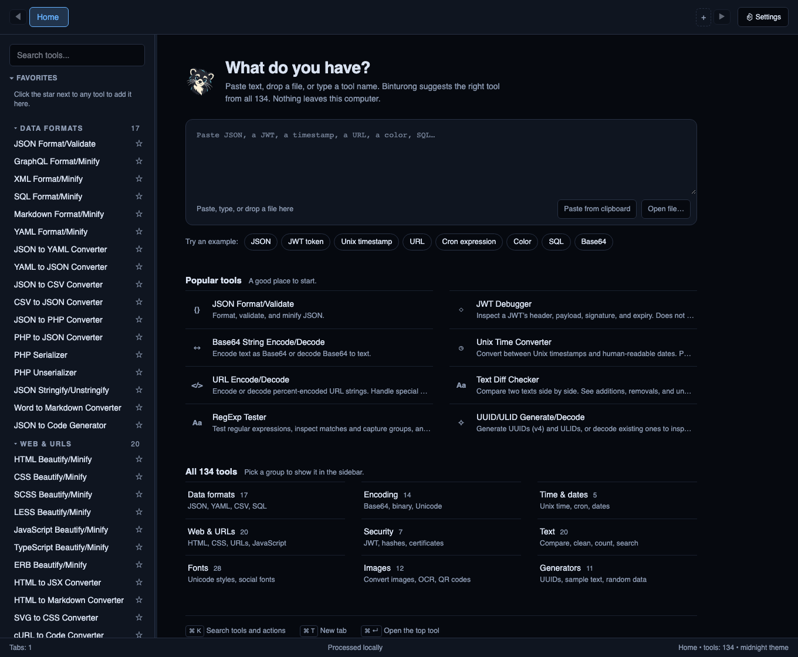
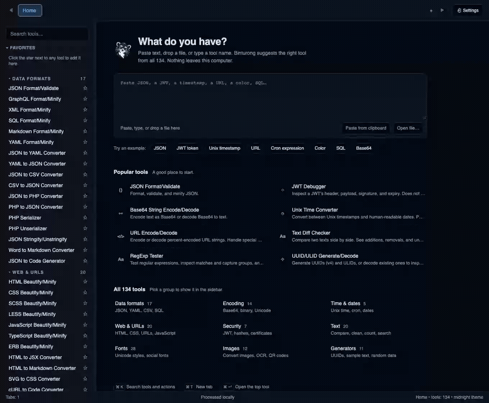

# Binturong

**Everyday developer tools, together on your desktop.**

Format code, convert data, and reuse a sequence of tools without leaving your
computer. Tool processing happens locally; installing OCR dependencies and
languages uses the network.

[Download for macOS, Windows, or Linux](https://github.com/alsatianco/binturong/releases/latest)
· [Website](https://play.alsatian.co/software/binturong.htm)
· [Quick start](how_to_use.md#quick-start-format-json-and-save-a-pipeline)

Free and open source · [MIT](LICENSE) · macOS (Apple Silicon/Intel), Windows x64,
Linux x86_64



## Install

Choose a download from [the latest release](https://github.com/alsatianco/binturong/releases/latest).

| Platform | Recommended download | Alternative |
| --- | --- | --- |
| macOS, Apple Silicon or Intel | `Binturong_<version>_macos-universal.zip` | Universal `.dmg` or Homebrew |
| Windows x64 | `Binturong_<version>_x64-setup.exe` | `.msi` |
| Linux x86_64 | `.deb` for Debian/Ubuntu; `.rpm` for Fedora | `.AppImage` |

macOS builds are ad-hoc signed and unnotarized; Windows builds have no publisher
signature. See the platform instructions below before installing.

### macOS installation

Download `Binturong_<version>_macos-universal.zip` (Apple Silicon and Intel).
Extract it, open the included DMG, drag Binturong to Applications, then eject the DMG.

Or install with Homebrew:

```bash
brew install --cask alsatianco/tap/binturong
```

Update with `brew update && brew upgrade --cask binturong`.

For current cask availability and CLI linking, see the independent
[Homebrew tap](https://github.com/alsatianco/homebrew-tap). A manual DMG install includes the CLI inside the
app bundle; run it at
`/Applications/Binturong.app/Contents/MacOS/binturong-cli`. To put it on your
`PATH`, link it from a directory already on your `PATH`.

If macOS blocks Binturong after either installation method and you trust the
download, run this in Terminal:

```bash
xattr -dr com.apple.quarantine /Applications/Binturong.app
```

Then open Binturong normally. This removes only its quarantine attribute; it does
not disable Gatekeeper globally. The downloadable
[`allow-binturong.sh`](packaging/macos/allow-binturong.sh) does the same after
checking the app's identity and accepts a different app path if needed.

### Windows installation

Download the `.exe` setup installer or `.msi` (x64). Builds currently have no
Windows publisher signature, so Windows may show an unknown-publisher warning.

### Linux installation

Download the x86_64 `.deb` (Debian/Ubuntu), `.rpm` (Fedora), or `.AppImage`.
For AppImage, make it executable with `chmod +x Binturong_*.AppImage`, then run it.
Linux installers are built on Ubuntu 22.04; test your target distribution before
rollout. AppImage may require your distribution's FUSE 2 compatibility package.

## Three useful workflows

### Turn an API response into reusable configuration

Open JSON Format/Validate, paste a JSON object, and click **Format**. For a
repeatable conversion, open the command palette with `Cmd/Ctrl+K`, choose
**actions → Open Pipeline Builder**, and add JSON Format/Validate followed by
JSON to YAML Converter. Run it, inspect each output, and save the chain.

[](docs/assets/workflow.mp4)

[Static pipeline screenshot](docs/assets/pipeline.png) · [MP4 demo](docs/assets/workflow.mp4)
· [Exact sample and steps](how_to_use.md#quick-start-format-json-and-save-a-pipeline)

### Inspect a token or decode text

Use JWT Debugger to inspect a header, payload, and expiration. It decodes tokens;
it does **not** verify signatures. Use Base64 String Encode/Decode or URL
Encode/Decode for their respective conversions. The command palette's **detect**
field suggests tools for text you enter.

### Use the same tools in a terminal

The packaged CLI accepts stdin, text files, and inline input:

```bash
binturong-cli run --tool json-format --file response.json \
  | binturong-cli run --tool json-to-yaml --output config.yaml
```

See [CLI usage](how_to_use.md#cli-usage) and the macOS CLI path above. CLI `list`
shows the registry; running tools still depends on the dispatcher's support and
input format.

## Selected features

- Code formatting, JSON/YAML/CSV conversion, Base64/URL encoding, hashes, dates,
  text transformations, image utilities, and OCR.
- Search, command palette, tabs, favorites, and recent tools.
- Saved pipelines with compatibility checks and per-step output.
- Batch processing for tools that expose **Batch** controls; presets and local
  history where supported.
- Desktop app built with Tauri, Rust, React, and TypeScript, plus a bundled CLI.

For examples, use the [tool reference](how_to_use.md#tool-reference). The
[current registry](src-tauri/src/tool_registry.rs) owns the inventory;
`binturong-cli list` reports it for your build. The v0.1.2 registry contains
134 tools, verified in the [launch preparation record](docs/launch-preparation.md).

## Why choose it / tradeoffs

Binturong fits repeated small tasks where a desktop workspace, saved pipelines,
and a CLI are useful together. Choose individual tools when that is sufficient;
choose a browser utility when installation is inconvenient. Pipelines are
limited to compatible formatter/converter operations, and formatter steps use
their default **Format** mode. They currently have no per-step direction or
configuration controls.

OCR needs a separate Tesseract installation. Automatic updates are not available;
install a newer release or update through Homebrew. Winget, Snap, and Flatpak
files in [packaging](packaging/README.md) are unpublished templates.

These alternatives cover many of the same tasks. Checked October 3, 2026 against
their official project pages; the suggested fit is a workflow choice, not a benchmark.

| Alternative | When it may fit better |
| --- | --- |
| [DevToys](https://devtoys.app/) | A cross-platform desktop toolbox with an extension ecosystem, clipboard smart detection, and a separate extensible CLI. |
| [DevUtils](https://devutils.com/) | A native macOS toolbox with clipboard detection and Terminal, Alfred, and Raycast integrations. |
| [IT-Tools](https://github.com/CorentinTh/it-tools) | Browser access or a self-hosted developer toolbox without a desktop installation. |
| [CyberChef](https://gchq.github.io/CyberChef/) | Composable recipes for encoding, decoding, and analysis in a browser or downloaded standalone copy. Processing is generally local, with explicit network operations. |

Binturong's combination is a desktop workspace, saved compatible pipelines, and
a bundled CLI. Local processing and composable workflows also exist elsewhere;
they are not exclusive claims.

## Privacy and limitations

Processing happens on your computer. Tesseract installation and OCR language
downloads use the network; project/download links open your browser. The current
app has no analytics or telemetry integration and no automatic update checks.

Tool runs can retain input and output in a local SQLite history (up to 20 entries
per tool). Saved chains also contain their input. **Remember last input** does
not disable history. Use **Clear tool history** or **Clear all history** to remove
recorded runs. Detection uses text you enter; the current UI does not monitor your
clipboard or maintain a clipboard history. See [privacy and data retention](docs/privacy.md)
for storage locations, deletion, and limits.

## Documentation and contributing

- [User guide](how_to_use.md): quick start, tools, settings, and CLI examples.
- [Contributing](CONTRIBUTING.md): setup pointers, focused validation, and adding a tool.
- [Security reporting](SECURITY.md) and [privacy](docs/privacy.md).
- [Documentation index](docs/README.md): maintained guides and dated evidence.
- [Report a bug](https://github.com/alsatianco/binturong/issues): include the version,
  platform, synthetic input, and expected result.

If Binturong saves you time, a [GitHub star](https://github.com/alsatianco/binturong)
or a [coffee](https://www.alsatian.co/p/coffee.html) helps support the project.

## Prerequisites

| Tool | Version | Notes |
| --- | --- | --- |
| [Node.js](https://nodejs.org/) | LTS | Frontend build |
| [Rust](https://rustup.rs/) | stable | Backend build via Cargo |

Platform-specific dependencies are listed in the [Building](#building) section.

## Development

```bash
npm install                # install JS dependencies
npm run tauri dev          # run desktop app in dev mode
npm run dev                # run frontend only (browser)
```

## Testing

```bash
npm run test:ui            # frontend unit/UI tests (vitest)
npm run test:coverage      # frontend tests with coverage
TAURI_CONFIG='{"bundle":{"externalBin":[]}}' cargo test --manifest-path src-tauri/Cargo.toml
```

The command-scoped `TAURI_CONFIG` override disables the bundled CLI sidecar check
for direct Cargo tests and preserves any existing shell value afterward. In
PowerShell, temporarily set `$env:TAURI_CONFIG` to the same JSON and restore its
previous value after the command. Installer builds stage the CLI automatically;
use the normal bundle configuration for those builds.

## Building

Build a production desktop executable:

```bash
npm install
npm run tauri build
```

Build output for all platforms:

- Executable: `src-tauri/target/release/binturong` (`.exe` on Windows)
- Bundles: `src-tauri/target/release/bundle/`

### Linux (Ubuntu/Debian)

Install system dependencies, then build:

```bash
sudo apt-get update && sudo apt-get install -y \
    libwebkit2gtk-4.1-dev libgtk-3-dev \
    libayatana-appindicator3-dev librsvg2-dev patchelf

curl --proto '=https' --tlsv1.2 -sSf https://sh.rustup.rs | sh  # if Rust is not installed
source ~/.cargo/env

npm run tauri build -- --bundles appimage,deb,rpm
```

### macOS

Requires Xcode (open it once to complete initial setup):

```bash
curl --proto '=https' --tlsv1.2 -sSf https://sh.rustup.rs | sh  # if Rust is not installed
source ~/.cargo/env

npm run tauri build -- --bundles dmg
```

> **Note:** Local Mac builds use ad-hoc signing by default and are not notarized. Developer ID signing requires Apple credentials and build configuration.

### Windows

Requires [Microsoft C++ Build Tools](https://visualstudio.microsoft.com/visual-cpp-build-tools/) with "Desktop development with C++" enabled. The app requires the WebView2 Runtime. The installer can bootstrap it when missing;
that download needs network access.

```powershell
# Install Rust via rustup-init.exe from https://rustup.rs/ if not available

# Optional: for MSI/NSIS installer bundles
choco install -y nsis wixtoolset

npm run tauri build -- --bundles msi,nsis
```

> **Note:** If MSI packaging fails with `light.exe` errors, ensure the Windows VBScript feature is enabled.

## Release and distribution

See the [release runbook](docs/releasing.md) for CI triggers, versioning, signing,
checksums, and installer validation, and [distribution packaging](packaging/README.md)
for package-manager preparation. Homebrew lives in the independent tap; winget,
Snap, and Flatpak candidates are unpublished.

Local release-candidate checks:

```bash
./scripts/release_candidate_qa.sh
```

## Performance Benchmarks

```bash
TAURI_CONFIG='{"bundle":{"externalBin":[]}}' cargo run --manifest-path src-tauri/Cargo.toml --release --bin perf-bench > perf-bench-local.csv
```

Build the frontend with `npm run build` before this release-mode Cargo run. OCR
measurement also needs Tesseract and English language data. The benchmark prints
CSV to stdout; the redirection above captures a new local result. Record the date,
platform, and run context when sharing a capture. The committed
[`docs/performance-bench.csv`](docs/performance-bench.csv) is historical evidence
explained in the [performance validation record](docs/performance-validation.md).

## License

[MIT](LICENSE)

## Privacy/Security Checks

- Run policy checks with:
  - `./scripts/privacy_security_check.sh`
- Validation artifact:
  - [Historical privacy/security validation](docs/privacy-security-validation.md)

## Dependency/License Audit

- Run dependency and license checks with:
  - `./scripts/dependency_license_audit.sh`
- Validation artifacts:
  - [Historical dependency/license audit](docs/dependency-license-audit.md)
  - [Bundled asset license manifest](docs/bundled-assets.tsv), an input to the audit script.
